# The Less I know the Greener: An adaptive language-agnostic pruning method for language models for code 

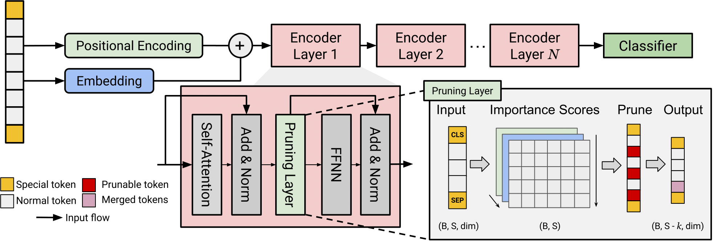

# Abstract

> Language models of code have demonstrated state-of-the-art performance across various software engineering and source code analysis tasks. However, their demanding computational resource requirements and consequential environmental footprint remain as significant challenges.
This work introduces ALPINE, an adaptive programming language-agnostic pruning technique designed to substantially reduce the computational overhead of these models. 
The proposed method offers a pluggable layer that can be integrated with all Transformer-based models.
With ALPINE,
input sequences undergo adaptive compression throughout the pipeline, reaching a size that is $\times 3$ less their initial size, resulting in significantly reduced computational load.
Our experiments on two software engineering tasks, _defect prediction_ and _code clone detection_ across three language models CodeBERT, GraphCodeBERT and UniXCoder show that ALPINE achieves up to a 50% reduction in FLOPs, a 58.1% decrease in memory footprint, and a 28.1% improvement in throughput on average. Importantly, it achieves the reduction in computation resources while maintaining up to 98.1% of the original predictive performance. 
These findings highlight the potential of ALPINE in making language models of code more resource-efficient and accessible while preserving their performance,
contributing to the overall sustainability of adopting language models in software development.

# Analytical Proof on FLOPs Bounds of the MHA and FFNN

We provide an analytical proof that demonstrates that the number of floating points operations performed in the FFNN layer is higher than the MHA's for all input lengths that fit within the maximum context length of the language models used in the study.  

**Lemma**. For every conceivable input sequence that fits into the context length of CodeBERT, GraphCodeBERT, and UnixCoder, it holds that $$F_{FFN} > {F_{MHA}}.$$

Let us fix $d:=d_{MHA}>0$, $h>0$ and consider the following function:

$$f(n) = F_{FFN}(n) - F_{MHA}(n) = n(8d^2 +3d) - n^2(4d+h)$$

This function

-   is quadratic

-   has a maximum $(f''(n) <0)$.

-   has two roots $n_1=0$ and $n_2=\frac{8d^2 +3d}{4d + h}$

therefore $f(n)>0$ or $F_{FFN} > F_{MHA}$ when $n\in(0,n_2)$.  

In other words, if the sequence length
$n\leq\lfloor \frac{8d^2 +3d}{4d + h} \rfloor$, then $F_{FFN} > F_{MHA}$

For UnixCoder, GraphCodeBERT, and CodeBERT, the maximum sequence lengths are $1024$, $512$, and $512$, respectively. Additionally, in those cases we have that $d=768$ and $h=12$, then we can infer the following:

$$\left\lfloor \frac{8d^2 +3d}{4d + h} \right\rfloor = 1375$$

In these models, it will consistently hold true that $n < \lfloor \frac{8d^2 +3d}{4d + h} \rfloor$, hence, $F_{FFN} > F_{MHA}$.

# Folder structure
- `pruning`: folder that contains the RoBERTa-based model that supports pruning, including the training script.  
    - `AttenPruner.py`: contains the implementation of `IQPruner layer`. It takes as input the attention probabilities of each attention head and, final output of the MHA and the attention mask. First, it takes the mean across all heads and tokens to obtain a score distribution. Then, it creates a new mask that indicate the tok
    - `PrunableEncoderLayer.py`: Contains the class `PrunableEncoderLayer` that implements the `forward` function of the Transformer layer.
    - `PrunableModel.py`: Inherits from `polp.nn.models.roberta.encoder.RoBERTaEncoder`, and overrides the `layers` attribute with `PrunableEncoderLayer`.
    - `classifier.py`: Contains a classification head on top of `PrunableModel` for the defect prediction task.
    - `bcb_classifier.py`: Contains a classification head on top of `PrunableModel` for the code clone detection task.
    - `utils.py`: Holds the implementation of utility functions. Notably, the `repack_tensor_and_create_mask` function (referred to `RepackTensor` in Algorithm 2 in the paper), that completely removes tokens from the output of the MHA, or mereges them.
- `extracted_data`:
    - `bcb`: Contains the average sequence length when progressing throughout the layers of the pruned models fine-tuned on the BigCloneBenchmark dataset.
    - `devign`: Contains the average sequence length when progressing throughout the layers of the pruned models fine-tuned on the Devign dataset.
    - `gpu_mem_cons.xlsx`: Excel file that contains the results of memory consumption of all models across the three tasks.
    - `impact_token_merging.xlsx`: Results of the ablation study that investigates the impact of token merging.
    - `running_time.xlsx`: Duration of fine-tuning each model on each task when using ALPINE versus when pruning is not used.
- `notebooks`:
    - `GPU_Memory_Consumption.ipynb`: Jupyter notebook used to draw the barplot for GPU memory consumption.
    - `running_time.ipynb`: Jupyter notebook used to draw the barplot for fine-tuning time.
    - `theoretical_flops_analysis.ipynb`: This is used to plot the FLOPs counting formulae of the MHA and FFNN layers.
    - `visualize_sequences.ipynb`: Plots the sequence lengths progression for pruned and non-pruned models. It uses the data located in the `extract_data` folder.
- `scripts`:
    - `train_*.py`: Training script for defect prediction and code clone detection.
    - `speed_test.py`: Calculates the throughput of a model using using the test set.
    - `flops_analysis.py`: Calculates the number of FLOPs of a model.
    

# Dependencies
This work uses `polp`, a library for source code intelligence. Currently, it is under development, but it does include all models that were used in this study.
```bash
pip3 install -e lib
```
The remaining dependencies are installed using,

```bash
pip3 install -r requirements.txt
```

# Running and Analysis
To fine-tune the models using the different pruning strategies, execute the following command:
```bash
python3 train.py \
	--do_train \
	--epoch 5 \
	--train_batch_size 32 \
	--eval_batch_size 64 \
	--learning_rate 2e-5 \
	--max_grad_norm 1.0 \
	--evaluate_during_training \
	--seed 123456 \
	--alpha 1. \
	--layers {PRUNING-STRAT} \
	--model_name {MODEL} \
```
The argument `layers` specifies the layers where ALPINE will be added.
| Value | Description |
|-------|-------------|
|   `none`    |  No layer will have ALPINE.           |
|   `all`    |   All layers will have ALPINE enabled.          |
|    `odd`   |    Only odd-indexed layers will have ALPINE.         |
|    `even`   |    Only even-indexed layers will have ALPINE.         |  

The `model_name` argument specifies the language model of code to be fine-tuned. We use model weights that are available on the Huggingface Hub.  

| Value | Description |
|-------|-------------|
|   `microsoft/codebert-base`    | CodeBERT.           |
|   `microsoft/graphcodebert-base`    | GraphCodeBERT.           |
|   `microsoft/unixcoder-base`    | UniXCoder.           |

Once the fine-tuning process is finished, a checkpoint of the model where it has performed the best across the epochs will be saved.  This checkpoint file will be used for the scripts below.  

Both `flops_analysis.py` and `speed_test.py` share the same set of arguments,
```bash
python3 {flops_analysis.py|speed_test.py} \
        --checkpoint ... \
        --task {TASK} \
        --model_name {MODEL} \
        --eval_batch_size 1 \
```
The `task` argument specifies which SE was the model fine-tuned on
| Value | Description |
|-------|-------------|
|   `defect_pred`    | Defect prediction (Devign dataset).         |
|   `code_clone`    | Code clone detection (BigCloneBenchmark dataset).         |  

The `model_name` argument is the same as the one mentioned above for fine-tuning instructions.
# Results

**NB**: 
Even index = [0, 2, 4, 6, 8, 10]  
Odd index = [1, 3, 5, 7, 9, 11]  

## Computational Costs and Impact of Accuracy
### Defect Prediction (Devign Dataset)
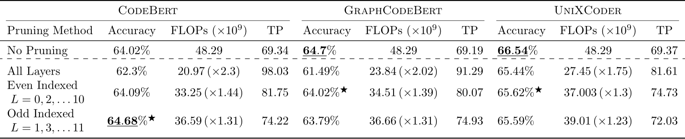

### Code Clone Detection (BigCloneBenchmark Dataset)
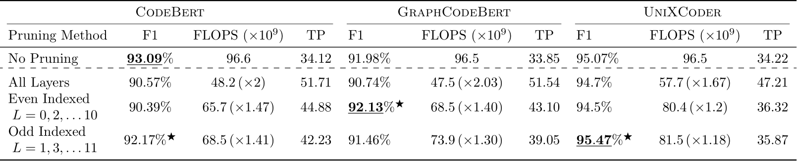

### Token Reduction
#### Defect Prediction (Devign Dataset)
<div style="display:flex;">
  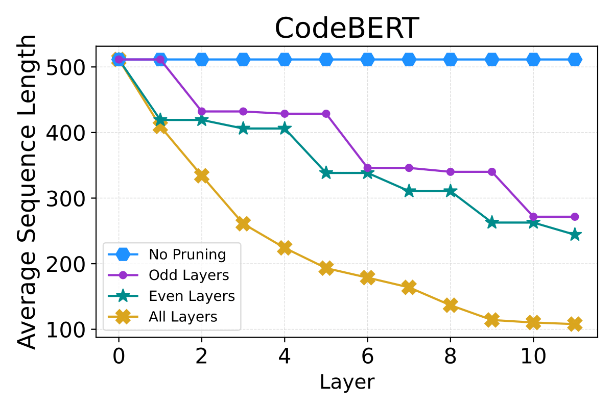
  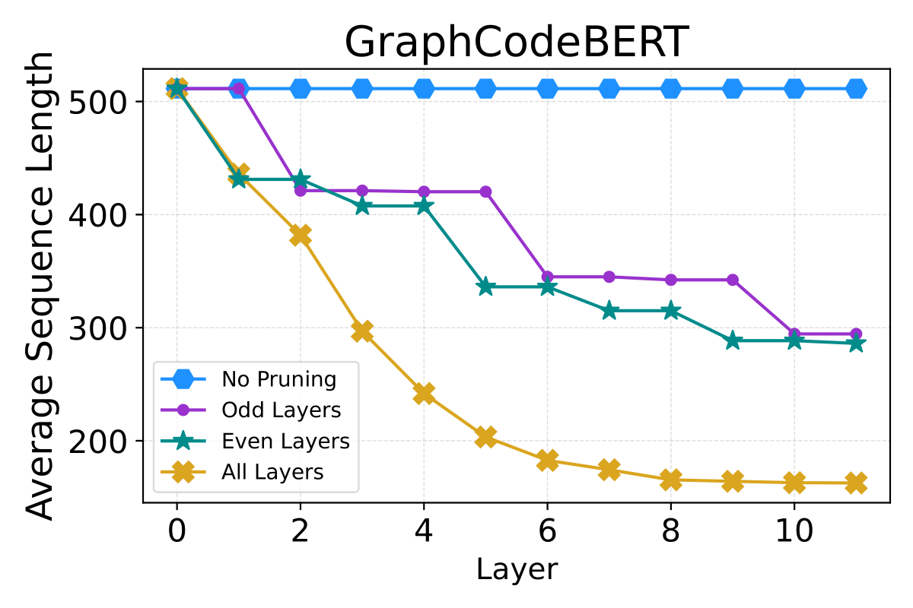
  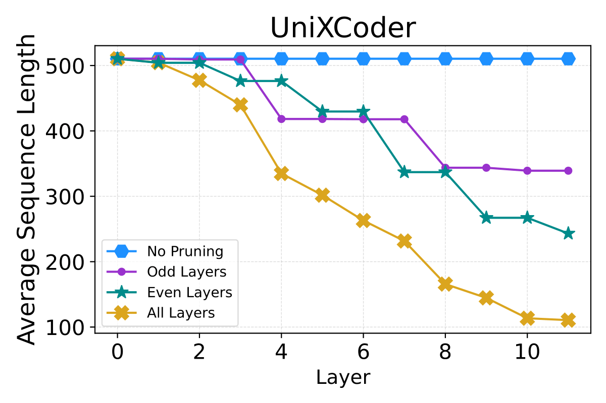
</div>

#### Code Clone Detection (BigCloneBenchmark Dataset)
<div style="display:flex;">
  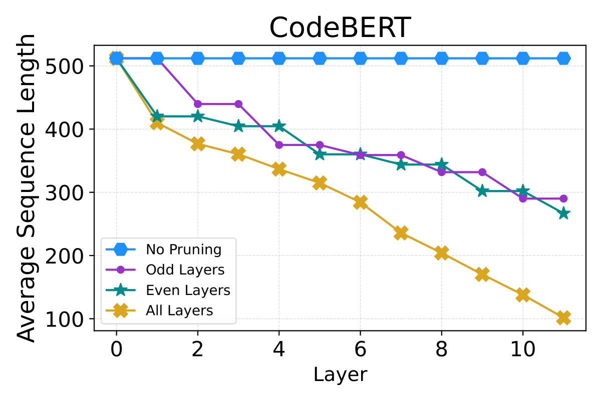
  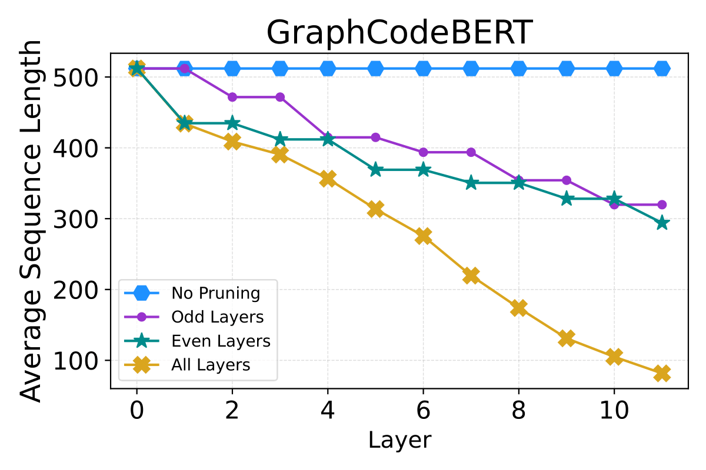
  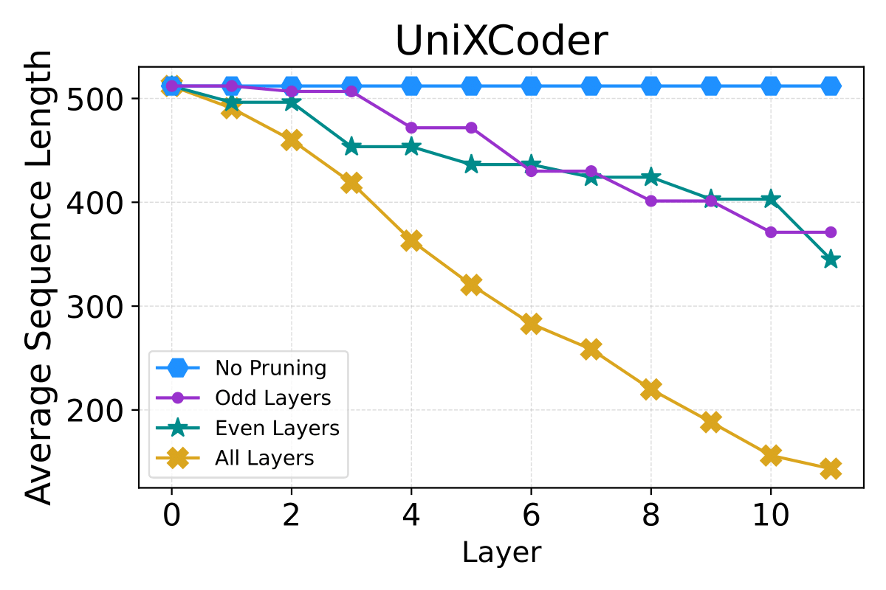
</div>

### Memory Footprint
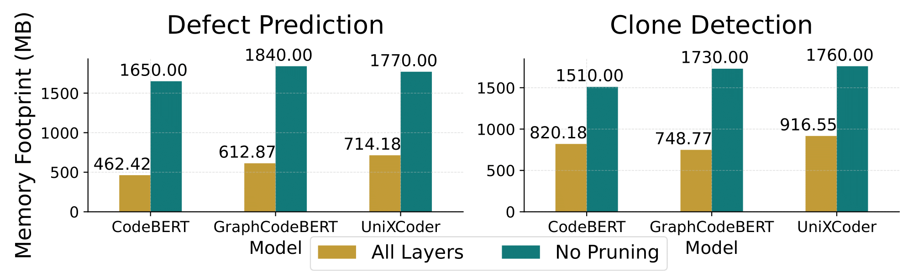

## Role of GPU and Impact of Carbon Emission

### Fine-tuning times
<div style="display:flex;">
<figure style="width:45%">
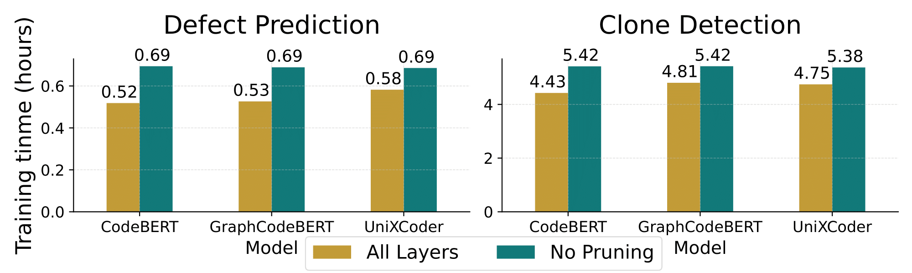
<figcaption>NVIDIA A100</figcaption>
</figure>
  &nbsp;
  <figure style="width:45%">
  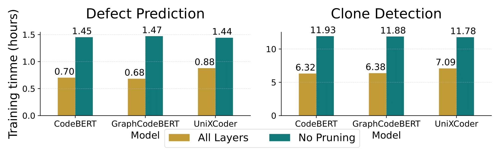
<figcaption>NVIDIA RTX2080</figcaption>
</figure>
</div>

### CO2 Emissions Reduction
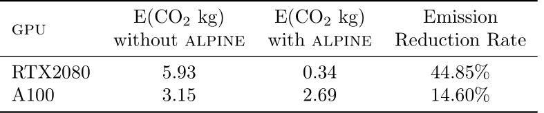